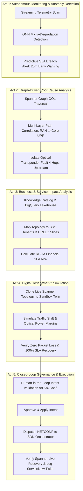

# Autonomous Network Operations: Network Digital Twin Agentic Suite

## Executive Overview
This repository contains the multi-agent system designed for **Gemini Enterprise Agent Platform (GEAP)** and **Google Agent Development Kit (ADK)**, implementing an **Intent-Driven Closed-Loop Autonomous Network Operations (Level 4 Autonomy)** powered by **Cloud Spanner Graph**, **Vertex AI GNNs (Distributed Graph Flow)**, and **BigQuery / Knowledge Catalog**.

---

## The 5-Act Autonomous Operations Workflow

---

## Agent Architecture Breakdown

| Agent Name | Primary GCP Services / Tools | Core Responsibility | Key Metric / Output |
| :--- | :--- | :--- | :--- |
| **Network Supervisor & Fault Detection Agent** | Vertex AI GNN (DGF), Spanner streaming metrics | Continuous spatial-temporal telemetry scans; micro-degradation prediction | 20-minute proactive SLA breach alert |
| **Root Cause Analysis (RCA) Agent** | Cloud Spanner Graph (GQL), Multi-layer Topology Traversal | Traverses RAN, IP transport, Optical WDM, Core UPF | Isolates faulty transponder 4 hops upstream |
| **Service Impact Analysis (SIA) Agent** | BigQuery Lakehouse, Knowledge Catalog, BSS Billing | Maps physical node to enterprise customer slices (URLLC) | Assesses $1.8M penalty risk across tenants |
| **Network Simulation & Remediation Agent** | Sandboxed Spanner Digital Twin, Traffic Flow Solvers | "What-If" reroute simulation, latency & optical budget verification | 100% SLA recovery with 0% packet loss |
| **Governance & Execution Agent** | SDN Orchestrator (NETCONF), ServiceNow, Cloud Audit Logs | Explainable audit trail, human approval, closed-loop execution | <2s intent execution, MTTR hours to seconds |
| **Network Digital Twin Master Orchestrator** | GEAP Cockpit, Gemini 2.5/3.5 | Coordinates end-to-end multi-agent lifecycle and executive dashboard | Unified CNO/CTO Command Center |
